<!-- ═══════════════════════════════════════════════════════════════
     KRISHNA PURI · GTA VICE-CITY PROFILE README
     Import guide: see INSTRUCTIONS.md in this pack
     ═══════════════════════════════════════════════════════════════ -->

<!-- status bar -->

## 🎮 TRANSMISSION

I build the parts of a system that **must not fail** — money paths, concurrency controls, telemetry pipelines, and cryptographic migration protocols. I don't do vibes-based engineering: every claim below is backed by a repository, a CI run, or a test that re-proves the behavior on every push.

**Press the buttons. Audit the evidence. That's the whole pitch.**

---

### 🗂️ PINNED OPERATIONS

### 🎯 MISSION BRIEFINGS

**`V-01 · VoltHub-CSMS`** — Two-engine EV charging management where the money path and the telemetry path are *deliberately* different databases: **Oracle 23ai** owns ACID billing + reservations, **TimescaleDB** owns high-volume telemetry. An **OCPP 1.6J** gateway drives a simulator fleet, and CI race-tests **both** engines on every push. Ships with a typography-led **Next.js** operations console, Codecov coverage, release automation and an OpenSSF Scorecard.

**`Q-02 · Q-Trust`** — Post-quantum cryptography migration as an actual pipeline, not a slide deck: scan your cryptographic estate (**CBOM**), score it against **NIST & CNSA 2.0**, plan the migration with a **GNN**, then seal tamper-proof attestations onchain — **11 UUPS registries on Base L2**.

---

### 📊 LIVE TELEMETRY

### 🐍 SNAKE CAM — LIVE FEED

<!-- snake eats the contribution grid · regenerated nightly by GitHub Actions -->
<picture>
  <source media="(prefers-color-scheme: dark)" srcset="https://raw.githubusercontent.com/humoge7502/humoge7502/output/github-contribution-grid-snake-dark.svg" />
  <source media="(prefers-color-scheme: light)" srcset="https://raw.githubusercontent.com/humoge7502/humoge7502/output/github-contribution-grid-snake.svg" />
  
</picture>

*Eating commits since day one. Auto-regenerated by `.github/workflows/snake.yml` — no manual work, ever.*

---

### 🧰 PRIMARY LOADOUT

**⌨️ LANGUAGES**

**🗄️ DATABASE ENGINES**

**🔐 PROTOCOLS & SECURITY**

**⚙️ INFRA & TOOLING**

---

### 🗺️ QUEST LOG

- 🟢 **ACTIVE QUEST** — Hardening the OCPP 1.6J gateway: edge cases, reconnect storms, firmware-update flows.
- 🟢 **ACTIVE QUEST** — Expanding Q-Trust CBOM coverage across deeper dependency trees and more language ecosystems.
- 🟡 **SIDE QUEST** — PQC handshake benchmarks on commodity hardware (numbers or it didn't happen).
- 🔵 **CO-OP SLOT OPEN** — Building something that must not fail? My DMs are open.

---

**The fastest co-op invite is a direct one.**

 

⚠️ No shortcuts were used in the making of this profile — every stat is real, every badge is earned, every claim is CI-verified.

