# Krishna Puri



**Systems engineer. I build the deterministic parts (money paths, concurrency, protocols) and the emerging parts (post-quantum cryptography, attestations) with the same discipline: trade-offs named, claims receipted, races proven in CI.**

> Every status below is a **live pipeline, not a claim**. If a build goes red, the badge goes red with it — that is the point.

---

## // SYSTEM STATUS

| engine | telemetry |
| --- | --- |
| [**VoltHub CSMS**](https://github.com/humoge7502/VoltHub-CSMS) — two-engine EV charging platform | [](https://github.com/humoge7502/VoltHub-CSMS/actions/workflows/ci.yml) [](https://github.com/humoge7502/VoltHub-CSMS/actions/workflows/security.yml) [](https://github.com/humoge7502/VoltHub-CSMS/releases) [](https://scorecard.dev/viewer.html?url=github.com/humoge7502/VoltHub-CSMS) [](https://humoge7502.github.io/VoltHub-CSMS/) |
| [**Q-Trust**](https://github.com/humoge7502/q-trust) — post-quantum crypto migration & attestation protocol | [](https://github.com/humoge7502/q-trust/actions/workflows/ci.yml) [](https://github.com/humoge7502/q-trust/actions/workflows/security.yml) [](https://github.com/humoge7502/q-trust/actions/workflows/pqc-scan.yml) [](https://github.com/humoge7502/q-trust/releases) [](https://humoge7502.github.io/q-trust) |


---

## // FEATURED MISSIONS

<table>
<tr>
<td width="50%" valign="top">

### ⚡ VoltHub CSMS

EV charging management where **the race demo is the shortest honest proof of the architecture**: two parallel bookings hit the same connector — exactly one `201 BOOKED`, one `409 OVERLAP`. CI fires that race on **every push, on both database engines**.

- **Oracle 23ai** money path — 25 relations, 7 PL/SQL packages, no DELETE anywhere
- **TimescaleDB** telemetry — hypertables, 1m/1h caggs, compression, retention
- **OCPP 1.6J** gateway + simulator fleet; **outbox + relay** joins the engines
- 49 OpenAPI paths / 53 routes behind a **drift gate**; 6-job CI; **zero known CVEs** (audit-gated)
- v1.4.0 shipped: httpOnly refresh session + family-wide logout (SEC-012)

```text
$ simulator --scenario race
POST /api/v1/reservations   201 BOOKED
POST /api/v1/reservations   409 OVERLAP
```

</td>
<td width="50%" valign="top">

### 🔐 Q-Trust

Post-quantum cryptography migration & attestation protocol: **scan your cryptographic estate · score it against NIST & CNSA 2.0 · plan migration with a GNN · seal tamper-proof attestations on Base L2.**

- **CBOM scanning** (CycloneDX) — "SBOM, but for cryptography"
- **GNN planner** ranks migration order from the crypto graph
- **Solidity attestation registry** on Base L2 — Foundry + **Halmos symbolic** in CI
- Dogfooded: the scanner runs on **its own repository** (`pqc-scan.yml`)
- PyPI + Docker publish pipelines, mkdocs Material docs site

```text
$ qtrust scan --deep --cbom
→ 12 algorithms found · 3 not PQ-ready
→ migration plan: 5 waves (GNN-ranked)
→ attestation sealed on Base L2
```

</td>
</tr>
</table>


---

## // LOADOUT

| domain | systems |
| --- | --- |
| languages | TypeScript · JavaScript · Python · PL/SQL · Solidity · SQL |
| backend | Node.js 22 · Express 5 · Fastify 5 · Next.js 16 · React 19 |
| data | Oracle 23ai (money path, outbox) · TimescaleDB (hypertables, caggs) · Redis |
| protocols | OCPP 1.6J (WebSocket gateways, simulator fleets) · REST / OpenAPI drift-gated |
| security | post-quantum migration (NIST / CNSA 2.0) · CBOM · gitleaks · CodeQL · Trivy · Scorecard |
| web3 | Solidity · Foundry · Halmos symbolic execution · Base L2 attestations |
| ml | GNN migration planning · RL · PyTorch-based planner |
| ops | Docker · GitHub Actions · mkdocs · DVC · pre-commit · conventional commits · ADRs |

## // FIELD MANUAL

- **Trade-offs, not fashion.** Every stack decision names its rejected alternative — [7 ADRs on VoltHub](https://github.com/humoge7502/VoltHub-CSMS/tree/main/docs/adr), design-kit notes on Q-Trust.
- **Honest limits.** The READMEs say what each project is *not*: simulated chargers, prepaid wallet, single-VM deploy. Trust compounds faster than hype.
- **Evidence on every push.** `npm audit`, CodeQL and the PQC self-scan are red/green CI gates. If CI cannot re-prove a claim, the claim comes off the README.

## // CURRENT OPERATIONS

- Hardening VoltHub's telemetry path — full-profile benchmarks (experiments 3–5) into `docs/perf.md`
- Studying the **OCPP 2.0.1 (IEC 63584)** migration path — the store surface is already protocol-neutral by design
- Extending Q-Trust's CBOM coverage toward **CNSA 2.0** compliance reporting

<details>
<summary><b>MISSION LOG</b> — recent deployments & honest deferrals</summary>

**shipped**

- `v1.4.0` — httpOnly refresh cookie, family-wide logout, CORS allow-list (SEC-012, regression-gated)
- 0 known CVEs across both lockfiles, held by a CI audit gate
- BUG-021 stale-socket race fixed with a regression test **validated to catch the bug**

**deferred by design**

- `oracledb 7` — held until db-backed CI validates it (drivers are not blind-bumped)
- Full-profile benchmarks — blocked by disk space on the dev box; local-profile numbers are re-measured instead

</details>

## // SIGNAL FEED

<!-- START:ACTIVITY -->
- 📡 feed updates daily (03:00 UTC) — real public events only
<!-- END:ACTIVITY -->

<picture>
  <source media="(prefers-color-scheme: dark)" srcset="https://raw.githubusercontent.com/humoge7502/humoge7502/output/github-contribution-grid-snake-dark.svg">
  <source media="(prefers-color-scheme: light)" srcset="https://raw.githubusercontent.com/humoge7502/humoge7502/output/github-contribution-grid-snake.svg">
  
</picture>

## // COMMS

[**LinkedIn**](https://www.linkedin.com/in/krishna-puri-3a9bba432) ·
[**VoltHub CSMS**](https://github.com/humoge7502/VoltHub-CSMS) ·
[**Q-Trust**](https://github.com/humoge7502/q-trust) ·
[**email**](mailto:orayan1267@gmail.com)

---

<sub>save file: `krishna-2026` · engines online: **2/2** · status: **buildable, tested, honest** — every badge above is a live pipeline.</sub>

<sub>looking for opportunities in systems engineering / backend / platform roles — [say hi](mailto:orayan1267@gmail.com)</sub>