# Krishna Puri

<picture>
  <source media="(prefers-color-scheme: dark)" srcset="assets/hero-console.svg" />
  <source media="(prefers-color-scheme: light)" srcset="assets/hero-console-light.svg" />
  
</picture>

**Systems engineer working at the boundary between reliable infrastructure and emerging security systems.** I build money paths, concurrency controls, protocols, cryptographic inventory, and attestation flows — then document the trade-offs and make CI re-prove the important behavior.

[LinkedIn](https://www.linkedin.com/in/krishna-puri-3a9bba432) · [VoltHub CSMS](https://github.com/humoge7502/VoltHub-CSMS) · [Q-Trust](https://github.com/humoge7502/q-trust)

> **Profile principle:** presentation should point to evidence. The projects below link directly to tests, architecture decisions, security checks, releases, and documentation. No fake metrics or skill percentages.

---

## `//00` SIGNALS

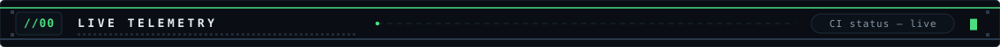

| VoltHub CSMS · EV charging infrastructure | Q-Trust · post-quantum migration and attestation |
| :--- | :--- |
| [](https://github.com/humoge7502/VoltHub-CSMS/actions/workflows/ci.yml) [](https://github.com/humoge7502/VoltHub-CSMS/actions/workflows/security.yml) [](https://github.com/humoge7502/VoltHub-CSMS/releases) [](https://humoge7502.github.io/VoltHub-CSMS/) | [](https://github.com/humoge7502/q-trust/actions/workflows/ci.yml) [](https://github.com/humoge7502/q-trust/actions/workflows/security.yml) [](https://github.com/humoge7502/q-trust/actions/workflows/halmos.yml) [](https://humoge7502.github.io/q-trust) |

<sub>Badges are external live services. They are useful status links, not proof by themselves; inspect the linked workflows and repository docs for scope.</sub>

---

## `//01` MISSIONS

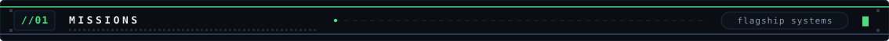

### MISSION 01 — [VOLT HUB CSMS](https://github.com/humoge7502/VoltHub-CSMS)

<a href="https://github.com/humoge7502/VoltHub-CSMS">
  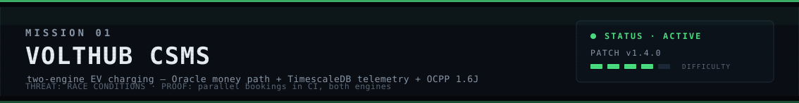
</a>

**The engineering problem:** keep billing and reservation invariants safe while telemetry remains optimized for time-series workloads.

- **Boundary:** Oracle 23ai owns reservations, billing, and the ledger; TimescaleDB owns telemetry.
- **Protocol:** OCPP 1.6J gateway and simulator fleet over WebSocket.
- **Reliability:** an outbox plus relay connects the engines with idempotent replay behavior.
- **Proof:** parallel reservation tests exercise the same-connector race; the OpenAPI contract has a CI drift gate.
- **Operations:** Docker Compose, structured request IDs, health/metrics endpoints, releases, ADRs, and a verification receipt.

```text
$ simulator --scenario race
POST /api/v1/reservations   201 BOOKED
POST /api/v1/reservations   409 OVERLAP
```

[Architecture](https://github.com/humoge7502/VoltHub-CSMS/blob/main/ARCHITECTURE.md) · [Race suite](https://github.com/humoge7502/VoltHub-CSMS/blob/main/apps/api/test/race.js) · [ADRs](https://github.com/humoge7502/VoltHub-CSMS/tree/main/docs/adr) · [Verification](https://github.com/humoge7502/VoltHub-CSMS/blob/main/docs/verification.md) · [Docs site](https://humoge7502.github.io/VoltHub-CSMS/)

### MISSION 02 — [Q-TRUST](https://github.com/humoge7502/q-trust)

<a href="https://github.com/humoge7502/q-trust">
  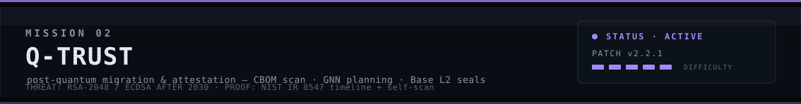
</a>

**The engineering problem:** make cryptographic debt discoverable, explainable, and auditable before migration becomes an incident.

- **Discover:** scan TLS, SSH, source, manifests, binaries, and configuration into CycloneDX CBOM output.
- **Decide:** score against documented security/compliance rules and rank migration work with a graph-based planner.
- **Attest:** record evidence through Solidity registries and an API/SDK boundary, with nonce-aware signed writes.
- **Verify:** contracts, SDK, backend, inspector, planner, frontend, security checks, docs, and formal-verification workflows live in one repository.
- **Scope honestly stated:** research/pre-release software; Base Sepolia/testnet posture; no independent external audit yet.

```text
$ crypto-inspector scan example.com --risk --compliance nist,cnsa
→ risk report + CycloneDX CBOM + migration roadmap
```

[Architecture](https://github.com/humoge7502/q-trust/blob/main/docs/ARCHITECTURE.md) · [Security policy](https://github.com/humoge7502/q-trust/blob/main/SECURITY.md) · [Contracts](https://github.com/humoge7502/q-trust/tree/main/contracts) · [Showcase](https://humoge7502.github.io/q-trust/showcase/) · [Docs site](https://humoge7502.github.io/q-trust)

---

## `//02` LOADOUT

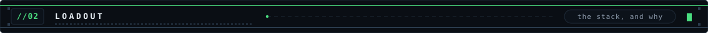

```text
systems       Oracle PL/SQL · TimescaleDB · PostgreSQL · data boundaries · outbox patterns
protocols     OCPP 1.6J · WebSockets · REST · OpenAPI contracts · signed attestations
security      post-quantum migration · CBOM · NIST/CNSA rule sets · threat modeling
platform      Node.js · Express · Next.js · Python · TypeScript · Solidity · Docker
verification  unit/integration tests · race tests · fuzz/invariant tests · Halmos · CI gates
practice      ADRs · conventional commits · dependency scanning · release notes · runbooks
```

This is a **working stack**, not a claim of mastery. Click the mission links to see where each technology is actually used.

### Engineering pattern

1. **Name the invariant or threat.** What must remain true when requests race, a socket reconnects, a worker hangs, or a dependency changes?
2. **Choose the boundary.** Keep money, telemetry, protocol state, and evidence in explicit interfaces.
3. **Write the receipt.** A test, workflow, ADR, benchmark method, or security note should make the claim inspectable.
4. **State the limit.** Simulated hardware, testnet deployments, local defaults, and deferred work belong in the docs too.

---

## `//03` PROOF MARKERS

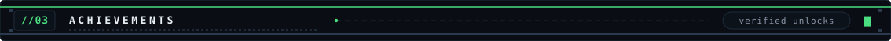

<a href="#missions">
  
</a>

These are **navigation markers**, not personal awards:

- **AUDITABLE** — project claims link to architecture, ADR, verification, security, or workflow evidence.
- **FORMAL VERIFICATION** — Q-Trust includes a Halmos workflow for the Solidity layer.
- **SELF-SCAN** — Q-Trust's PQC readiness workflow scans the repository itself.
- **RACE TESTED** — VoltHub includes a double-booking race scenario and runs it through CI.
- **SECURITY GATED** — both flagship repositories expose dedicated security workflows; inspect their current run status before relying on a badge.

---

## `//04` DATALOG

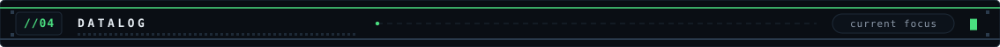

- Hardening VoltHub's telemetry path and publishing measured benchmark results from `bench/`.
- Evaluating the OCPP 2.0.1 migration path while keeping the store surface protocol-neutral.
- Extending Q-Trust CBOM coverage and compliance reporting toward CNSA 2.0.

<details>
<summary><b>Known limits and next evidence</b></summary>

- VoltHub's durable path depends on Oracle and TimescaleDB; its local profile is intentionally faster and in-process.
- VoltHub uses simulated chargers and a prepaid wallet; it does not claim card-rail or hardware production readiness.
- Q-Trust is research/pre-release software with testnet posture and no independent external contract audit.
- Full-profile performance claims are deferred until the benchmark harness produces reproducible tables.

</details>

---

## `//05` ACTIVITY

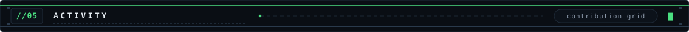

<picture>
  <source media="(prefers-color-scheme: dark)" srcset="https://raw.githubusercontent.com/humoge7502/humoge7502/output/github-contribution-grid-snake-dark.svg" />
  <source media="(prefers-color-scheme: light)" srcset="https://raw.githubusercontent.com/humoge7502/humoge7502/output/github-contribution-grid-snake.svg" />
  
</picture>

**Recent high-signal transmissions** — the profile workflow keeps this block limited to pushes, releases, pull requests, and issue state changes. Comments, deletes, stars, and workflow noise stay out.

<!-- START:ACTIVITY -->
_No high-signal public events available yet._
<!-- END:ACTIVITY -->

---

## `//06` COMMS

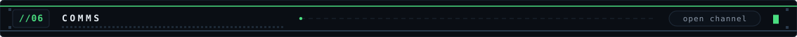

[**LinkedIn**](https://www.linkedin.com/in/krishna-puri-3a9bba432) · [**GitHub**](https://github.com/humoge7502) · [**VoltHub CSMS**](https://github.com/humoge7502/VoltHub-CSMS) · [**Q-Trust**](https://github.com/humoge7502/q-trust)

<sub>K/OS profile build: original HUD-inspired visual language, no copyrighted game assets, no JavaScript, no fake metrics.</sub>

<details>
<summary><b>GitHub compatibility notes</b></summary>

- **Supported:** Markdown, semantic HTML, tables, collapsibles, local SVG/PNG assets, theme-aware `<picture>`, and GitHub Actions.
- **External dependencies:** live badges, GitHub Pages links, and the contribution snake; each has a readable fallback or direct repository link.
- **Not used:** JavaScript, iframes, CSS injection, unsupported inline interactions, fake progress meters, or third-party “stats” walls.
- **Motion:** subtle SVG SMIL animation only in local image assets; it is decorative and the textual README remains complete without it.

</details>

<!-- K/OS Operator Console — generated visuals live in assets/ and are rebuilt by
     tools/build_assets.py. Keep the activity markers stable: the scheduled
     update-activity workflow rewrites only the block between them. -->
