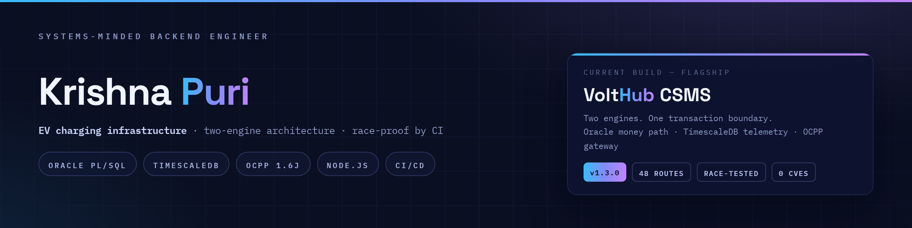

# Krishna Puri

**Systems-minded backend engineer — EV charging infrastructure, two-engine data architecture, race-proof by CI.**

[](https://github.com/humoge7502/VoltHub-CSMS)
[](https://github.com/humoge7502/VoltHub-CSMS/releases)
[](https://www.linkedin.com/in/krishna-puri-3a9bba432)



---

## The flagship: [VoltHub CSMS](https://github.com/humoge7502/VoltHub-CSMS)

An EV charging management platform where the **race demo is the shortest honest
proof of the architecture**: two parallel bookings hit the same connector and
time window — exactly one gets `201 BOOKED`, the other `409 OVERLAP`. CI fires
that race on **every push, on both database engines**.

|                                                                                                 |                                                                                                   |
| :---------------------------------------------------------------------------------------------: | :-----------------------------------------------------------------------------------------------: |
| **Oracle 23ai** owns the money path — 25 relations, 7 PL/SQL packages, guard trigger, no DELETE | **TimescaleDB** owns telemetry — hypertables, 1m/1h continuous aggregates, compression, retention |
|   **Outbox + relay** joins them — same-transaction outbox, ack-after-COMMIT, effectively-once   |       **OCPP 1.6J** gateway — WebSocket, per-charger credentials, 10 msg/s, simulator fleet       |

- 48 REST routes with an OpenAPI **drift gate** in CI
- 6-job pipeline: lint (Node 20/22) · security audit gate · quality · coverage (c8 → Codecov) · db-tests on real Oracle + Timescale containers · full-stack e2e
- Zero known CVEs across both lockfiles — `npm audit` is a red/green gate
- Every claim has a receipt: [`docs/verification.md`](https://github.com/humoge7502/VoltHub-CSMS/blob/main/docs/verification.md), 7 ADRs with named rejected alternatives

```text
$ simulator --scenario race
POST /api/v1/reservations   201 BOOKED
POST /api/v1/reservations   409 OVERLAP
```

## What I actually do

```text
backend & data   Oracle PL/SQL · TimescaleDB · outbox patterns · concurrency & race safety
protocols        OCPP 1.6J (WebSocket gateways, simulator fleets) · REST/OpenAPI contracts
platform         Node.js 20/22 · Express 5 · Next.js 16 · Docker Compose · GitHub Actions
discipline       conventional commits · ADRs · CI-gated audits · receipts over claims
```

## How I work

- **Trade-offs, not fashion.** Every stack decision names its rejected
  alternative — [7 ADRs](https://github.com/humoge7502/VoltHub-CSMS/tree/main/docs/adr)
  and counting.
- **Honest limits.** The README says what the project is _not_: simulated
  chargers, prepaid wallet, single-VM deploy. Trust compounds faster than hype.
- **Evidence on every push.** If CI can't re-prove a claim, the claim comes off
  the README.

## Now

- Hardening VoltHub's telemetry path (full-profile benchmarks from `bench/`)
- Studying the OCPP 2.0.1 (IEC 63584) migration path — the store surface is
  already protocol-neutral by design

[**LinkedIn**](https://www.linkedin.com/in/krishna-puri-3a9bba432) ·
[**VoltHub CSMS**](https://github.com/humoge7502/VoltHub-CSMS) ·
[**Docs site**](https://humoge7502.github.io/VoltHub-CSMS/)
