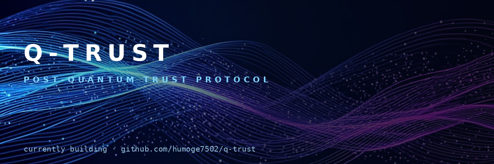

<!-- GitHub profile README — place in the repository humoge7502/humoge7502
     (create a repo named exactly humoge7502, same as your username, and this
     README renders on your profile page). Assets used from ./assets/ folder.
     Edit the marked <!-- EDIT --> spots: bio, social links, location. -->

<div align="center">
  
</div>

<div align="center">
  <a href="https://readme-typing-svg.demolab.com?font=JetBrains+Mono&size=17&pause=1100&color=00D9FF&center=true&vCenter=true&random=false&width=640&separator=%3B&lines=Building+Q-Trust+%E2%80%94+the+post-quantum+trust+protocol;Open+source%3A+qtrust-sdk+%C2%B7+qtrust-inspector+on+PyPI;Scan+%E2%86%92+score+%E2%86%92+plan+%E2%86%92+attest;Ship+fast.+Test+harder.+Anchor+on-chain.">
    
  </a>
</div>

<br/>

<div align="center">

<a href="https://github.com/humoge7502"></a>
<a href="https://github.com/humoge7502?tab=followers"></a>
<a href="https://github.com/humoge7502/q-trust/stargazers"></a>

</div>

---

### 👨‍💻 About Me

```python
class Engineer:
    """<!-- EDIT: tweak to taste -->"""
    focus      = "post-quantum cryptography × blockchain × applied ML"
    building   = "Q-Trust — PQC migration & attestation protocol (Base L2)"
    stack      = ["Solidity/Foundry", "TypeScript/Fastify/Next.js",
                  "Python/PyTorch", "Rust (learning)"]
    pypi       = ["qtrust-sdk", "qtrust-inspector"]
    principles = ["measure, then claim",
                  "189 tests > 189 promises",
                  "every attestation is tamper-evident or it didn't happen"]
```

---

### 🔥 Currently Building

<div align="center">
  <a href="https://github.com/humoge7502/q-trust">
    <picture>
      <source media="(prefers-color-scheme: dark)" srcset="assets/profile-hero-dark.png"/>
      <source media="(prefers-color-scheme: light)" srcset="assets/profile-hero-light.png"/>
      
    </picture>
  </a>

<br/>

<a href="https://github.com/humoge7502/q-trust/actions/workflows/ci.yml"></a>
<a href="https://github.com/humoge7502/q-trust/actions/workflows/pqc-scan.yml"></a>
<a href="https://github.com/humoge7502/q-trust/releases"></a>
<a href="https://github.com/humoge7502/q-trust/blob/main/LICENSE"></a>

**[Q-Trust](https://github.com/humoge7502/q-trust)** — scan a cryptographic estate, score it against
NIST IR 8547 / CNSA 2.0 timelines, plan migration with a GNN (Kendall τ **0.961**),
and seal tamper-proof attestations on Base L2 via 11 UUPS registries.

</div>

---

### 🐍 Contribution Graph

<picture>
  <source media="(prefers-color-scheme: dark)" srcset="https://raw.githubusercontent.com/humoge7502/humoge7502/output/github-contribution-grid-snake-dark.svg" />
  <source media="(prefers-color-scheme: light)" srcset="https://raw.githubusercontent.com/humoge7502/humoge7502/output/github-contribution-grid-snake.svg" />
  
</picture>

<sub>↺ regenerated daily by [snake.yml](.github/workflows/snake.yml) — allow it one day to draw the first snake</sub>

---

### 📊 GitHub Stats

<div align="center">
  
  
  <br/>
  
  <a href="https://github.com/ryo-ma/github-profile-trophy">
    
  </a>
</div>

---

### 🛠 Tech Stack

<div align="center">

**Languages & Core**

<a href="https://skillicons.dev"></a>

**Blockchain**


**AI / ML & Infra**


</div>

---

### 📈 Activity

<div align="center">
  
</div>

---

### 📡 Recent Activity

<!-- START:ACTIVITY -->
- 📦 discussion in **q-trust**
- 📦 discussion in **q-trust**
- 📦 discussion in **q-trust**
- 🏷️ published release v2.2.0 in **q-trust**
- 🏷️ published release v2.1.1 in **q-trust**
<!-- END:ACTIVITY -->

<sub>↺ auto-refreshed daily by [update-activity.yml](.github/workflows/update-activity.yml) — self-built GitHub Actions pipeline</sub>

---

<div align="center">

### 📫 Connect

<!-- EDIT: replace # with your real profile URLs -->

<a href="https://github.com/humoge7502"></a>
<a href="#"></a>
<a href="#"></a>
<a href="#"></a>

</div>

<br/>

<div align="center">
  
</div>

<div align="center">
  <sub>⬆ <a href="#top">back to top</a> · crafted with obsessive attention to detail</sub>
</div>
